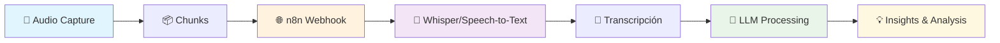
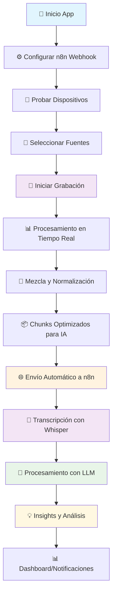
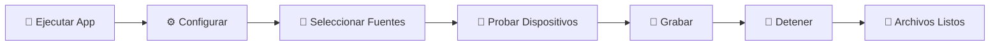

# 🎵 Audio Capture Widget for AI Transcription

<div align="center">


[](https://python.org)
[](https://pypi.org/project/PySide6/)
[](https://n8n.io)
[](LICENSE)
[](https://github.com/Pedroru101/audioAiV2)

**🤖 Captura de audio profesional para transcripción con IA y procesamiento LLM 🧠**

*Integración directa con n8n para workflows de transcripción automática*

[📥 Descargar](#-instalación) • [🤖 Setup n8n](#-integración-con-n8n) • [🧠 LLM Workflows](#-workflows-de-ia) • [🐛 Reportar Bug](https://github.com/Pedroru101/audioAiV2/issues) • [💡 Sugerir Feature](https://github.com/Pedroru101/audioAiV2/discussions)

</div>

---

## ✨ Características Principales

<table>
<tr>
<td width="50%">

### 🤖 **IA & Transcripción**
- 🧠 **Integración n8n**: Envío automático para transcripción
- 🎯 **Chunks Inteligentes**: Segmentos optimizados para IA
- 🔄 **Procesamiento LLM**: Preparado para GPT, Claude, etc.
- 📝 **Workflow Automático**: De audio a texto a insights

</td>
<td width="50%">

### 🎤 **Grabación Profesional**
- 🎯 **Captura Simultánea**: Micrófono + Sistema
- 🔀 **Selección Flexible**: Solo mic, solo sistema, o ambos
- 📊 **Calidad IA-Ready**: 44.1kHz, 16-bit optimizado
- 🔄 **Mezcla Inteligente**: Normalización para transcripción

</td>
</tr>
<tr>
<td width="50%">

### 🌐 **Integración Avanzada**
- 🔗 **n8n Webhook**: Conexión directa con workflows
- 📡 **API Ready**: Formato optimizado para servicios de IA
- 🔄 **Tiempo Real**: Envío automático de chunks
- 🎛️ **Configurable**: Adapta a tu pipeline de IA

</td>
<td width="50%">

### 🎨 **Experiencia de Usuario**
- 🪟 **Interfaz Flotante**: Siempre visible durante grabación
- 🎭 **Diseño Minimalista**: No distrae del trabajo
- 🖱️ **Arrastrable**: Posiciona donde necesites
- ⚙️ **Setup Rápido**: Configuración en minutos

</td>
</tr>
</table>

---

## 🤖 Caso de Uso Principal: Pipeline de IA

<div align="center">

### 🎯 **De Audio a Insights con IA**



**🎯 Perfecto para**: Transcripción de reuniones, análisis de llamadas, procesamiento de podcasts, documentación automática

</div>

---


## 📥 Instalación

### 🚀 Opción 1: Ejecutable (Recomendado)

<div align="center">

**🎯 ¡La forma más fácil!**

[](https://github.com/Pedroru101/audioAiV2/releases)

</div>

1. 📥 **Descargar** el [último release](https://github.com/Pedroru101/audioAiV2/releases)
2. 🖱️ **Ejecutar** `AudioCaptureWidget.exe`
3. 🎉 **¡Listo para usar!**

### 🛠️ Opción 2: Desde Código Fuente

<details>
<summary>👨‍💻 <strong>Para Desarrolladores</strong> (Click para expandir)</summary>

#### 1️⃣ Clonar el repositorio
```bash
git clone https://github.com/Pedroru101/audioAiV2.git
cd audioAiV2
```

#### 2️⃣ Crear entorno virtual
```bash
python -m venv venv
```

#### 3️⃣ Activar entorno virtual
```bash
# 🪟 Windows
.\venv\Scripts\activate

# 🐧 Linux/Mac
source venv/bin/activate
```

#### 4️⃣ Instalar dependencias
```bash
pip install -r requirements.txt
```

#### 5️⃣ Ejecutar la aplicación
```bash
python main.py
```

</details>

---

## 🤖 Integración con n8n

<div align="center">

**🧠 Configuración para Workflows de IA**

</div>

#### 🔧 Configuración Básica
```json
{
  "webhook_url": "http://localhost:5678/webhook/audio-transcription",
  "chunk_duration": 30,  // Optimizado para transcripción
  "auto_send": true,
  "format": "wav"        // Mejor calidad para IA
}
```

#### 🎯 Ejemplo de Workflow n8n
```javascript
// Webhook recibe audio → Whisper API → GPT-4 → Base de datos
{
  "nodes": [
    {
      "name": "Audio Webhook",
      "type": "n8n-nodes-base.webhook",
      "parameters": {
        "path": "audio-transcription"
      }
    },
    {
      "name": "Whisper Transcription", 
      "type": "n8n-nodes-base.openAi",
      "parameters": {
        "operation": "transcribe"
      }
    },
    {
      "name": "LLM Analysis",
      "type": "n8n-nodes-base.openAi", 
      "parameters": {
        "operation": "chat",
        "prompt": "Analiza esta transcripción y extrae insights clave..."
      }
    }
  ]
}
```

---

## 🧠 Workflows de IA

<div align="center">

### 🎯 **Casos de Uso con LLM**

</div>

<table>
<tr>
<td align="center" width="33%">

**📞 Análisis de Llamadas**
```
🎤 Llamada
↓
🤖 Transcripción
↓  
🧠 Sentiment Analysis
↓
📊 Report Automático
```

</td>
<td align="center" width="33%">

**🎙️ Procesamiento de Podcasts**
```
🎵 Podcast Audio
↓
📝 Transcripción Completa
↓
🔍 Extracción de Temas
↓
📚 Resumen Inteligente
```

</td>
<td align="center" width="33%">

**👥 Reuniones Inteligentes**
```
🏢 Audio de Reunión
↓
📋 Transcripción
↓
✅ Action Items
↓
📧 Follow-up Automático
```

</td>
</tr>
</table>

### 🔧 Configuraciones Recomendadas por Caso de Uso

<details>
<summary>📞 <strong>Llamadas de Negocio</strong></summary>

```json
{
  "chunk_duration": 60,     // Chunks de 1 minuto
  "record_microphone": true,
  "record_system": true,    // Captura ambos lados
  "webhook_url": "http://localhost:5678/webhook/business-call",
  "metadata": {
    "use_case": "business_call",
    "transcription_model": "whisper-large",
    "llm_prompt": "Analiza esta llamada de negocio y extrae: decisiones tomadas, próximos pasos, y sentiment del cliente"
  }
}
```

</details>

<details>
<summary>🎙️ <strong>Contenido de Podcast</strong></summary>

```json
{
  "chunk_duration": 120,    // Chunks de 2 minutos
  "record_microphone": true,
  "record_system": false,   // Solo host
  "webhook_url": "http://localhost:5678/webhook/podcast-processing",
  "metadata": {
    "use_case": "podcast",
    "transcription_model": "whisper-large",
    "llm_prompt": "Crea un resumen ejecutivo, extrae quotes destacados y genera timestamps de temas principales"
  }
}
```

</details>

<details>
<summary>👥 <strong>Reuniones de Equipo</strong></summary>

```json
{
  "chunk_duration": 45,     // Chunks de 45 segundos
  "record_microphone": true,
  "record_system": true,    // Captura presentaciones
  "webhook_url": "http://localhost:5678/webhook/meeting-notes",
  "metadata": {
    "use_case": "team_meeting",
    "transcription_model": "whisper-medium",
    "llm_prompt": "Identifica action items, asignaciones, deadlines y decisiones tomadas"
  }
}
```

</details>

### 🎯 Servicios de IA Compatibles

<div align="center">

| Servicio | Transcripción | LLM Processing | Integración |
|----------|---------------|----------------|-------------|
| 🤖 **OpenAI** | Whisper API | GPT-4/GPT-3.5 | ✅ n8n nativo |
| 🧠 **Anthropic** | - | Claude | ✅ Via API |
| 🔊 **AssemblyAI** | Speech-to-Text | - | ✅ Webhook |
| 🎵 **Deepgram** | Nova-2 | - | ✅ Streaming |
| ☁️ **Azure** | Speech Service | OpenAI Service | ✅ Cognitive Services |

</div>

---


## 🔄 Flujo de Trabajo Completo

<div align="center">

### 🎯 **Pipeline Completo: Audio → IA → Insights**



**🎯 Tiempo total**: Audio → Insights en menos de 30 segundos

</div>

---

## 🎯 Guía de Uso

### 🚀 Inicio Rápido

<div align="center">



</div>

#### 1️⃣ **Ejecutar**
- 🖱️ Doble clic en `AudioCaptureWidget.exe`
- ⚡ O ejecuta `python main.py`

#### 2️⃣ **Configurar**
- ⚙️ Presiona el botón de Configuración
- 🎨 Se abre el panel animado

#### 3️⃣ **Seleccionar Fuentes**
Elige qué grabar según tus necesidades:

<table>
<tr>
<td align="center">

**🎤 Solo Micrófono**
```
☑️ 🎤 Grabar Micrófono
☐ 🔊 Grabar Sistema
```
*Perfecto para podcasts, voces*

</td>
<td align="center">

**🔊 Solo Sistema**
```
☐ 🎤 Grabar Micrófono  
☑️ 🔊 Grabar Sistema
```
*Ideal para música, videos*

</td>
<td align="center">

**🎵 Ambos (Recomendado)**
```
☑️ 🎤 Grabar Micrófono
☑️ 🔊 Grabar Sistema
```
*Grabación completa*

</td>
</tr>
</table>

#### 4️⃣ **Probar Dispositivos**
- 🧪 Usa los botones **"Probar"** para test de 3 segundos
- ▶️ Presiona **"▶"** para escuchar las grabaciones
- ✅ Verifica que todo funcione correctamente

#### 5️⃣ **Grabar**
- 🎤 Presiona el botón de **GRABAR**
- 🛑 Aparece el botón de **DETENER**
- 📊 Observa el estado en tiempo real

---

## ⚙️ Configuración Avanzada

### 🎤 Dispositivos de Audio

<div align="center">

| Tipo | Recomendación | Descripción |
|------|---------------|-------------|
| 🎤 **Micrófono** | Cualquier dispositivo estándar | WASAPI o MME preferido |
| 🔊 **Sistema** | VB-Audio Cable | Para captura de aplicaciones |
| 🎧 **Monitoreo** | Auriculares/Altavoces | Para escuchar pruebas |

</div>

### 🔊 Configuración de Sistema Audio

<details>
<summary>🛠️ <strong>Setup VB-Audio Cable</strong> (Recomendado)</summary>

#### 📥 Instalación
1. 🌐 Descargar [VB-Audio Cable](https://vb-audio.com/Cable/)
2. 🔧 Instalar como administrador
3. 🔄 Reiniciar el sistema

#### ⚙️ Configuración
1. 🎵 **En tus aplicaciones** (Spotify, YouTube, etc.):
   - Seleccionar **"CABLE Input"** como salida de audio
2. 🎤 **En Audio Capture Widget**:
   - Seleccionar **"CABLE Output"** como dispositivo de sistema

#### ✅ Verificación
```
Aplicación → CABLE Input → CABLE Output → Audio Capture Widget
```

</details>

---

## 🔧 Configuración JSON

<details>
<summary>⚙️ <strong>Archivo config.json</strong></summary>

```json
{
  "input_device": 2,           // 🎤 ID del micrófono
  "output_device": 1,          // 🔊 ID del dispositivo de sistema
  "webhook_url": "http://...", // 🌐 URL del webhook
  "chunk_duration": 4,         // ⏱️ Duración en segundos
  "record_microphone": true,   // 🎤 Habilitar micrófono
  "record_system": true        // 🔊 Habilitar sistema
}
```

</details>

---

## 🆘 Solución de Problemas

<div align="center">

### 🚨 Problemas Comunes y Soluciones

</div>

<details>
<summary>🔊 <strong>No se detecta audio del sistema</strong></summary>

#### 🔍 Diagnóstico
- ❌ VB-Audio Cable no instalado
- ❌ Configuración incorrecta de aplicaciones
- ❌ Dispositivo incorrecto seleccionado

#### ✅ Solución
1. 📥 Instalar [VB-Audio Cable](https://vb-audio.com/Cable/)
2. ⚙️ Configurar aplicaciones para usar **"CABLE Input"**
3. 🎯 Seleccionar **"CABLE Output"** en la aplicación
4. 🧪 Probar con el botón **"Test"**

</details>

<details>
<summary>⚠️ <strong>Errores de "Input Overflow"</strong></summary>

#### 🔍 Síntomas
- ❌ Audio cortado o distorsionado
- ❌ Mensajes de overflow en logs
- ❌ Grabación interrumpida

#### ✅ Solución
1. 🔄 Usar dispositivos **MME** en lugar de **WASAPI**
2. ⏱️ Aumentar `chunk_duration` a **8-10 segundos**
3. ❌ Cerrar otras aplicaciones de audio
4. 🔧 Reducir calidad de audio si es necesario

</details>

---

## 📦 Dependencias

<div align="center">

### 🛠️ Stack Tecnológico

</div>

<table>
<tr>
<td align="center">

**🖼️ Interfaz**
- 🎨 **PySide6**: Framework GUI
- 🎭 **Qt**: Widgets y animaciones

</td>
<td align="center">

**🎵 Audio**
- 🎤 **sounddevice**: Captura de audio
- 🔢 **numpy**: Procesamiento numérico
- 📊 **scipy**: Análisis de audio

</td>
<td align="center">

**🔧 Utilidades**
- 🎵 **pydub**: Manipulación de audio
- 🎼 **lameenc**: Codificación MP3
- 🌐 **requests**: Comunicación webhook

</td>
</tr>
</table>

---

## 🎵 Formatos Soportados

<div align="center">

| Formato | Calidad | Uso Recomendado |
|---------|---------|-----------------|
| 🎵 **WAV** | 44.1kHz, 16-bit | Máxima calidad |
| 🎼 **MP3** | 128kbps | Distribución web |
| 📊 **Mono/Estéreo** | Configurable | Según necesidad |

</div>

---

## 🏗️ Construcción del Ejecutable

<details>
<summary>🛠️ <strong>Build Your Own</strong></summary>

### 📋 Prerrequisitos
```bash
pip install PyInstaller
```

### 🚀 Construcción
```bash
# 🏗️ Construir ejecutable
python build.py

# 📦 Crear paquete de distribución
python create_distribution.py
```

### 📁 Resultado
```
dist/
└── 🎵 AudioCaptureWidget.exe  # ✨ Tu ejecutable listo
```

</details>

---

## 🤝 Contribuir

<div align="center">

**🌟 ¡Las contribuciones son bienvenidas! 🌟**

[](https://github.com/Pedroru101/audioAiV2/graphs/contributors)
[](https://github.com/Pedroru101/audioAiV2/network/members)
[](https://github.com/Pedroru101/audioAiV2/stargazers)

</div>

### 🚀 Cómo Contribuir

1. 🍴 **Fork** el proyecto
2. 🌿 **Crea** una rama para tu feature (`git checkout -b feature/AmazingFeature`)
3. 💾 **Commit** tus cambios (`git commit -m 'Add some AmazingFeature'`)
4. 📤 **Push** a la rama (`git push origin feature/AmazingFeature`)
5. 📄 **Abre** un Pull Request

### 🎯 Áreas de Contribución

<table>
<tr>
<td align="center">

**🐛 Bug Fixes**
- Reportar bugs
- Corregir errores
- Mejorar estabilidad

</td>
<td align="center">

**✨ Features**
- Nuevas funcionalidades
- Mejoras de UI/UX
- Optimizaciones

</td>
<td align="center">

**📚 Documentación**
- Mejorar README
- Tutoriales
- Ejemplos de uso

</td>
</tr>
</table>

---

## 📋 Changelog

<details>
<summary>📋 <strong>Historial de Versiones</strong></summary>

### 🎉 v1.0.0 (2024-07-22)
- ✨ **Nueva**: Selección flexible de fuentes de grabación
- 🧪 **Nueva**: Prueba independiente de dispositivos con reproducción
- 📊 **Mejorado**: Soporte optimizado para VB-Audio Cable
- 📦 **Nuevo**: Empaquetado en ejecutable standalone
- 🧹 **Mejorado**: Proyecto limpio y optimizado
- 📚 **Nueva**: Documentación completa y visual
- 🎨 **Mejorado**: Interfaz más intuitiva y responsive
- 🔧 **Nuevo**: Sistema de configuración avanzado

</details>

---

## 🐛 Problemas Conocidos

<div align="center">

### ⚠️ Limitaciones Actuales

</div>

| Problema | Descripción | Solución |
|----------|-------------|----------|
| 🛡️ **Windows Defender** | Puede marcar el ejecutable como sospechoso | Falso positivo - Agregar excepción |
| 🎤 **Permisos de Micrófono** | Windows puede solicitar permisos | Permitir acceso la primera vez |
| 🔊 **VB-Audio** | Requiere instalación separada | Descargar desde sitio oficial |

---

## 📄 Licencia

<div align="center">

**📜 MIT License**

[](LICENSE)

*Este proyecto está bajo la Licencia MIT - ver el archivo [LICENSE](LICENSE) para detalles*

</div>

---

## 🙏 Agradecimientos

<div align="center">

### 👏 Gracias a estas increíbles tecnologías

</div>

<table>
<tr>
<td align="center">

**🎨 UI Framework**
[](https://pypi.org/project/PySide6/)

</td>
<td align="center">

**🎵 Audio Engine**
[](https://pypi.org/project/sounddevice/)

</td>
<td align="center">

**🔊 Virtual Audio**
[](https://vb-audio.com/)

</td>
<td align="center">

**📦 Packaging**
[](https://pyinstaller.org/)

</td>
</tr>
</table>

---

## 📞 Soporte y Contacto

<div align="center">

### 🆘 ¿Necesitas Ayuda?

[](https://github.com/Pedroru101/audioAiV2/issues)
[](https://github.com/Pedroru101/audioAiV2/discussions)
[](https://github.com/Pedroru101)

</div>

### 🎯 Canales de Soporte
- 🐛 **Bugs**: [GitHub Issues](https://github.com/Pedroru101/audioAiV2/issues)
- 💬 **Preguntas**: [GitHub Discussions](https://github.com/Pedroru101/audioAiV2/discussions)
- 🤖 **Setup n8n**: [Ejemplos de Workflows](https://github.com/Pedroru101/audioAiV2/discussions/categories/n8n-workflows)
- 🧠 **IA Integration**: [LLM Best Practices](https://github.com/Pedroru101/audioAiV2/discussions/categories/ai-integration)
- 📧 **Contacto**: A través de GitHub
- 📚 **Wiki**: Documentación extendida (próximamente)

---

<div align="center">

## 🌟 ¡Dale una Estrella!

**Si te gusta este proyecto, ¡no olvides darle una estrella!** ⭐

[](https://star-history.com/#Pedroru101/audioAiV2&Date)

---

### 🤖 **Desarrollado con ❤️ para la comunidad de automatizaciones** 🔧

**🚀 Audio Capture Widget - Donde el audio se convierte en inteligencia 🎯**

*Potenciando workflows de transcripción y análisis con LLM*

---

*⚡ Hecho con Python • 🪟 Optimizado para Windows 10+ • 🤖 IA-Ready • 🌟 Open Source Forever*

</div>