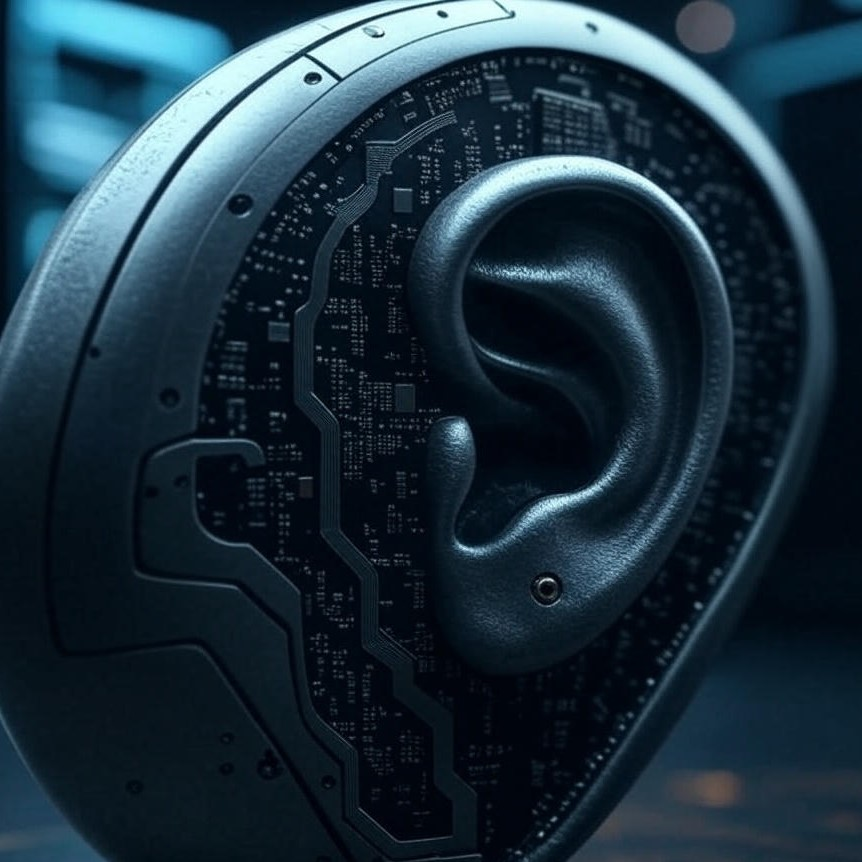

# 🎵 Audio Capture Widget

<div align="center">



[](https://python.org)
[](https://pypi.org/project/PySide6/)
[](LICENSE)
[](https://github.com/Pedroru101/audioAiV2)

**🚀 Aplicación profesional de grabación de audio simultánea 🎤🔊**

*Interfaz flotante minimalista con funcionalidades avanzadas*

[📥 Descargar](#-instalación) • [📖 Documentación](#-guía-de-uso) • [🐛 Reportar Bug](https://github.com/Pedroru101/audioAiV2/issues) • [💡 Sugerir Feature](https://github.com/Pedroru101/audioAiV2/discussions)

</div>

---

## ✨ Características Principales

<table>
<tr>
<td width="50%">

### 🎤 **grabación Avanzada**
- 🎯 **grabación Simultánea**: Micrófono + Sistema
- 🔀 **selección Flexible**: Solo mic, solo sistema, o ambos
- 📊 **Calidad Profesional**: 44.1kHz, 16-bit
- 🔄 **Mezcla Inteligente**: Normalización automática

</td>
<td width="50%">

### 🎨 **Interfaz Moderna**
- 🪟 **Ventana Flotante**: Siempre visible
- 🎭 **Minimalista**: Diseño limpio y elegante
- 🖱️ **Arrastrable**: Posiciona donde quieras
- ⚙️ **Panel Animado**: Configuración intuitiva

</td>
</tr>
<tr>
<td width="50%">

### 🔧 **Funcionalidades Pro**
- 🧪 **Prueba de Dispositivos**: Test de 3 segundos
- ▶️ **Reproducción Instantánea**: Escucha tus pruebas
- 📦 **Chunks Configurables**: 2-300 segundos
- 🌐 **Webhook Integration**: n8n compatible

</td>
<td width="50%">

### 🚀 **Distribución**
- 📱 **Ejecutable Standalone**: Sin Python requerido
- 🔒 **Seguro**: Sin dependencias externas
- ⚡ **Rápido**: Inicio instantáneo
- 🎯 **Optimizado**: Tamaño mínimo

</td>
</tr>
</table>

---

## 🎬 Demo Visual

<div align="center">

### 🎯 **Interfaz Principal & Panel de Configuración**

*Panel de Configuración completo con selección de dispositivos, fuentes de grabación y Configuración de webhook para n8n*

### 🎤 **Widget Flotante Minimalista**

*Interfaz flotante compacta con controles esenciales: Grabar, Config y Status - Siempre visible durante el trabajo*

**🎨 Características Visuales:**
- ✨ **Interfaz oscura profesional** - Diseño moderno que no cansa la vista
- 🎯 **Controles intuitivos** - Botones grandes y accesibles para uso rápido
- 🔄 **Animaciones suaves** - Transiciones elegantes entre estados
- 📱 **Diseño arrastrable** - Posiciona el widget donde lo necesites
- ⚙️ **Panel expandible** - Configuración completa sin saturar la interfaz
- 🎛️ **Configuración visual** - selección de dispositivos con pruebas en tiempo real

</div>

---

## 📥 Instalación

### 🚀 Opción 1: Ejecutable (Recomendado)

<div align="center">

**🎯 ¡La forma más fácil!**

[](https://github.com/Pedroru101/audioAiV2/releases)

</div>

1. 📥 **Descargar** el [último release](https://github.com/Pedroru101/audioAiV2/releases)
2. 🖱️ **Ejecutar** `AudioCaptureWidget.exe`
3. 🎉 **¡Listo para usar!**

### 🛠️ Opción 2: Desde Código Fuente

<details>
<summary>👨‍💻 <strong>Para Desarrolladores</strong> (Click para expandir)</summary>

#### 1️⃣ Clonar el repositorio
```bash
git clone https://github.com/Pedroru101/audioAiV2.git
cd audioAiV2
```

#### 2️⃣ Crear entorno virtual
```bash
python -m venv venv
```

#### 3️⃣ Activar entorno virtual
```bash
# 🪟 Windows
.\venv\Scripts\activate

# 🐧 Linux/Mac
source venv/bin/activate
```

#### 4️⃣ Instalar dependencias
```bash
pip install -r requirements.txt
```

#### 5️⃣ Ejecutar la aplicación
```bash
python main.py
```

</details>

---

## 🎯 Guía de Uso

### 🚀 Inicio Rápido

```mermaid
graph LR
    A[🚀 Ejecutar App] --> B[⚙️ Configurar]
    B --> C[🎯 Seleccionar Fuentes]
    C --> D[🧪 Probar Dispositivos]
    D --> E[🎤 Grabar]
    E --> F[🛑 Detener]
    F --> G[📁 Archivos Listos]
```

<div align="center">



</div>

#### 1️⃣ **Ejecutar**
- 🖱️ Doble clic en `AudioCaptureWidget.exe`
- âš¡ O ejecuta `python main.py`

#### 2️⃣ **Configurar**
- ⚙️ Presiona el botón de Configuración
- 🎨 Se abre el panel animado

#### 3️⃣ **Seleccionar Fuentes**
Elige qué grabar según tus necesidades:

<table>
<tr>
<td align="center">

**🎤 Solo Micrófono**
```
☑️ 🎤 Grabar Micrófono
☐ 🔊 Grabar Sistema
```
*Perfecto para podcasts, voces*

</td>
<td align="center">

**🔊 Solo Sistema**
```
☐ 🎤 Grabar Micrófono  
☑️ 🔊 Grabar Sistema
```
*Ideal para música, videos*

</td>
<td align="center">

**🎵 Ambos (Recomendado)**
```
☑️ 🎤 Grabar Micrófono
☑️ 🔊 Grabar Sistema
```
*grabación completa*

</td>
</tr>
</table>

#### 4️⃣ **Probar Dispositivos**
- 🧪 Usa los botones **"Probar"** para test de 3 segundos
- ▶️ Presiona **"▶"** para escuchar las grabaciones
- ✅ Verifica que todo funcione correctamente

#### 5️⃣ **Grabar**
- 🎤 Presiona el botón de **GRABAR**
- 🛑 Aparece el botón de **DETENER**
- 📊 Observa el estado en tiempo real

---

## ⚙️ Configuración Avanzada

### 🎤 Dispositivos de Audio

<div align="center">

| Tipo | Recomendación | Descripción |
|------|---------------|-------------|
| 🎤 **Micrófono** | Cualquier dispositivo estándar | WASAPI o MME preferido |
| 🔊 **Sistema** | VB-Audio Cable | Para captura de aplicaciones |
| 🎧 **Monitoreo** | Auriculares/Altavoces | Para escuchar pruebas |

</div>

### 🔊 Configuración de Sistema Audio

<details>
<summary>🛠️ <strong>Setup VB-Audio Cable</strong> (Recomendado)</summary>

#### 📥 Instalación
1. 🌐 Descargar [VB-Audio Cable](https://vb-audio.com/Cable/)
2. 🔧 Instalar como administrador
3. 🔄 Reiniciar el sistema

#### ⚙️ Configuración
1. 🎵 **En tus aplicaciones** (Spotify, YouTube, etc.):
   - Seleccionar **"CABLE Input"** como salida de audio
2. 🎤 **En Audio Capture Widget**:
   - Seleccionar **"CABLE Output"** como dispositivo de sistema

#### ✅ Verificación
```
Aplicación → CABLE Input → CABLE Output → Audio Capture Widget
```

</details>

### 🌐 Webhook Configuration

<div align="center">

**🔗 Integración con n8n y otros servicios**

</div>

```json
{
  "webhook_url": "http://localhost:5678/webhook/audio",
  "chunk_duration": 4,
  "auto_send": true
}
```

---

## 📁 Estructura del Proyecto

<div align="center">

```
🎵 Audio Capture Widget/
├── 🚀 main.py                 # Aplicación principal
├── 🎤 audio_handler.py        # Motor de grabación
├── 🧪 audio_device_tester.py  # Prueba de dispositivos
├── 🔧 utils.py                # Utilidades
├── 🏗️ build.py                # Script de construcción
├── 📦 create_distribution.py  # Creador de paquetes
├── ⚙️ config.json             # Configuración
├── 📋 requirements.txt        # Dependencias
├── 📖 CONTRIBUTING.md         # Guía de contribución
├── 📄 LICENSE                 # Licencia MIT
├── 🖼️ Imgapp.jpg              # Captura del panel de Configuración
├── �️ Imgwi.jpog               # Captura del widget flotante
├── 🎨 assets/                 # Recursos (si existe)
├── 📁 grabaciones/            # Grabaciones finales
└── 📁 .github/                # Configuración de GitHub
    ├── 🔧 workflows/          # GitHub Actions
    ├── 📋 ISSUE_TEMPLATE/     # Templates de issues
    └── 👥 CODEOWNERS          # Propietarios del código
```

</div>

---

## 🔧 Configuración JSON

<details>
<summary>⚙️ <strong>Archivo config.json</strong></summary>

```json
{
  "input_device": 2,           // 🎤 ID del micrófono
  "output_device": 1,          // 🔊 ID del dispositivo de sistema
  "webhook_url": "http://...", // 🌐 URL del webhook
  "chunk_duration": 4,         // ⏱️ Duración en segundos
  "record_microphone": true,   // 🎤 Habilitar micrófono
  "record_system": true        // 🔊 Habilitar sistema
}
```

</details>

---

## 🆘 Solución de Problemas

<div align="center">

### 🚨 Problemas Comunes y Soluciones

</div>

<details>
<summary>🔊 <strong>No se detecta audio del sistema</strong></summary>

#### 🔍 Diagnóstico
- ❌ VB-Audio Cable no instalado
- ❌ Configuración incorrecta de aplicaciones
- ❌ Dispositivo incorrecto seleccionado

#### ✅ Solución
1. 📥 Instalar [VB-Audio Cable](https://vb-audio.com/Cable/)
2. ⚙️ Configurar aplicaciones para usar **"CABLE Input"**
3. 🎯 Seleccionar **"CABLE Output"** en la aplicación
4. 🧪 Probar con el botón **"Test"**

</details>

<details>
<summary>⚠️ <strong>Errores de "Input Overflow"</strong></summary>

#### 🔍 Síntomas
- ❌ Audio cortado o distorsionado
- ❌ Mensajes de overflow en logs
- ❌ grabación interrumpida

#### ✅ Solución
1. 🔄 Usar dispositivos **MME** en lugar de **WASAPI**
2. ⏱️ Aumentar `chunk_duration` a **8-10 segundos**
3. ❌ Cerrar otras aplicaciones de audio
4. 🔧 Reducir calidad de audio si es necesario

</details>

<details>
<summary>🛑 <strong>Botón de parar no aparece</strong></summary>

#### 🔍 Posibles Causas
- ❌ Configuración no guardada
- ❌ Dispositivos no seleccionados
- ❌ Error en inicialización

#### ✅ Solución
1. ✅ Verificar que la Configuración esté guardada
2. 🔄 Reiniciar la aplicación
3. 🧪 Probar dispositivos antes de grabar
4. 📋 Revisar logs para errores

</details>

---

## 📦 Dependencias

<div align="center">

### 🛠️ Stack Tecnológico

</div>

<table>
<tr>
<td align="center">

**🖼️ Interfaz**
- 🎨 **PySide6**: Framework GUI
- 🎭 **Qt**: Widgets y animaciones

</td>
<td align="center">

**🎵 Audio**
- 🎤 **sounddevice**: Captura de audio
- 🔢 **numpy**: Procesamiento numérico
- 📊 **scipy**: Análisis de audio

</td>
<td align="center">

**🔧 Utilidades**
- 🎵 **pydub**: Manipulación de audio
- 🎼 **lameenc**: Codificación MP3
- 🌐 **requests**: Comunicación webhook

</td>
</tr>
</table>

---

## 🎵 Formatos Soportados

<div align="center">

| Formato | Calidad | Uso Recomendado |
|---------|---------|-----------------|
| 🎵 **WAV** | 44.1kHz, 16-bit | Máxima calidad |
| 🎼 **MP3** | 128kbps | Distribución web |
| 🔊 **Mono/Estéreo** | Configurable | Según necesidad |

</div>

---

## 🔄 Flujo de Trabajo

```mermaid
graph TD
    A[🚀 Inicio] --> B[⚙️ Configuración]
    B --> C[🧪 Prueba de Dispositivos]
    C --> D[🎯 selección de Fuentes]
    D --> E[🎤 grabación]
    E --> F[📊 Procesamiento]
    F --> G[🔄 Mezcla Inteligente]
    G --> H[📦 Chunks Automáticos]
    H --> I[🌐 Envío Webhook]
    I --> J[💾 Almacenamiento Local]
    
    style A fill:#e1f5fe
    style E fill:#f3e5f5
    style J fill:#e8f5e8
```

<div align="center">



</div>

---

## 🏗️ Construcción del Ejecutable

<details>
<summary>🛠️ <strong>Build Your Own</strong></summary>

### 📋 Prerrequisitos
```bash
pip install PyInstaller
```

### 🚀 Construcción
```bash
# 🏗️ Construir ejecutable
python build.py

# 📦 Crear paquete de distribución
python create_distribution.py
```

### 📁 Resultado
```
dist/
└── 🎵 AudioCaptureWidget.exe  # ✨ Tu ejecutable listo
```

</details>

---

## 🤝 Contribuir

<div align="center">

**🌟 ¡Las contribuciones son bienvenidas! 🌟**

[](https://github.com/Pedroru101/audioAiV2/graphs/contributors)
[](https://github.com/Pedroru101/audioAiV2/network/members)
[](https://github.com/Pedroru101/audioAiV2/stargazers)

</div>

### 🚀 Cómo Contribuir

1. 🍴 **Fork** el proyecto
2. 🌿 **Crea** una rama para tu feature (`git checkout -b feature/AmazingFeature`)
3. 💾 **Commit** tus cambios (`git commit -m 'Add some AmazingFeature'`)
4. 📤 **Push** a la rama (`git push origin feature/AmazingFeature`)
5. 🔄 **Abre** un Pull Request

### 🎯 Áreas de Contribución

<table>
<tr>
<td align="center">

**🐛 Bug Fixes**
- Reportar bugs
- Corregir errores
- Mejorar estabilidad

</td>
<td align="center">

**✨ Features**
- Nuevas funcionalidades
- Mejoras de UI/UX
- Optimizaciones

</td>
<td align="center">

**📚 Documentación**
- Mejorar README
- Tutoriales
- Ejemplos de uso

</td>
</tr>
</table>

---

## 📝 Changelog

<details>
<summary>📋 <strong>Historial de Versiones</strong></summary>

### 🎉 v1.0.0 (2024-07-22)
- ✨ **Nueva**: selección flexible de fuentes de grabación
- 🧪 **Nueva**: Prueba independiente de dispositivos con reproducción
- 🔊 **Mejorado**: Soporte optimizado para VB-Audio Cable
- 📦 **Nuevo**: Empaquetado en ejecutable standalone
- 🧹 **Mejorado**: Proyecto limpio y optimizado
- 📚 **Nueva**: Documentación completa y visual
- 🎨 **Mejorado**: Interfaz más intuitiva y responsive
- 🔧 **Nuevo**: Sistema de Configuración avanzado

</details>

---

## 🐛 Problemas Conocidos

<div align="center">

### ⚠️ Limitaciones Actuales

</div>

| Problema | Descripción | Solución |
|----------|-------------|----------|
| 🛡️ **Windows Defender** | Puede marcar el ejecutable como sospechoso | Falso positivo - Agregar excepción |
| 🎤 **Permisos de Micrófono** | Windows puede solicitar permisos | Permitir acceso la primera vez |
| 🔊 **VB-Audio** | Requiere instalación separada | Descargar desde sitio oficial |

---

## 📄 Licencia

<div align="center">

**📜 MIT License**

[](LICENSE)

*Este proyecto está bajo la Licencia MIT - ver el archivo [LICENSE](LICENSE) para detalles*

</div>

---

## 🙏 Agradecimientos

<div align="center">

### 💝 Gracias a estas increíbles tecnologías

</div>

<table>
<tr>
<td align="center">

**🎨 UI Framework**
[](https://pypi.org/project/PySide6/)

</td>
<td align="center">

**🎵 Audio Engine**
[](https://pypi.org/project/sounddevice/)

</td>
<td align="center">

**🔊 Virtual Audio**
[](https://vb-audio.com/)

</td>
<td align="center">

**📦 Packaging**
[](https://pyinstaller.org/)

</td>
</tr>
</table>

---

## 📞 Soporte y Contacto

<div align="center">

### 🆘 ¿Necesitas Ayuda?

[](https://github.com/Pedroru101/audioAiV2/issues)
[](https://github.com/Pedroru101/audioAiV2/discussions)
[](https://github.com/Pedroru101)

</div>

### 🎯 Canales de Soporte

- 🐛 **Bugs**: [GitHub Issues](https://github.com/Pedroru101/audioAiV2/issues)
- 💬 **Preguntas**: [GitHub Discussions](https://github.com/Pedroru101/audioAiV2/discussions)
- 📧 **Contacto**: A través de GitHub
- 📚 **Wiki**: Documentación extendida (próximamente)

---

<div align="center">

## 🌟 ¡Dale una Estrella!

**Si te gusta este proyecto, ¡no olvides darle una estrella!** ⭐

[](https://star-history.com/#Pedroru101/audioAiV2&Date)

---

### 🎵 **Desarrollado con ❤️ para la comunidad de audio** 🎵

**🚀 Audio Capture Widget - Donde la tecnología se encuentra con la creatividad 🎨**

---

*⚡ Hecho con Python • 🎨 Diseñado para Windows • 🌟 Open Source Forever*

</div>

